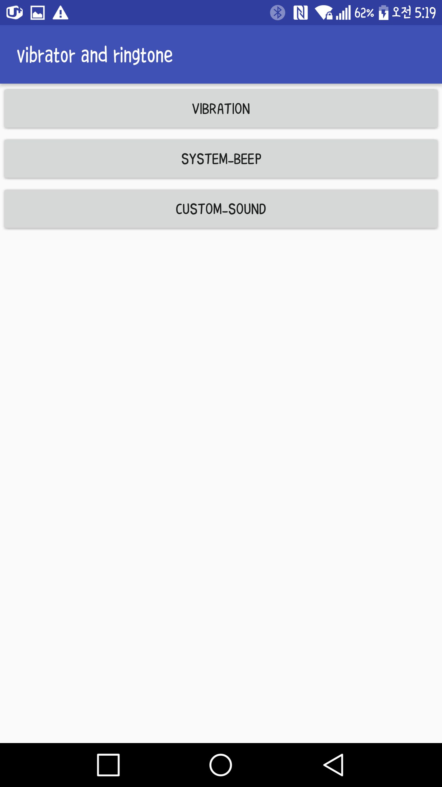
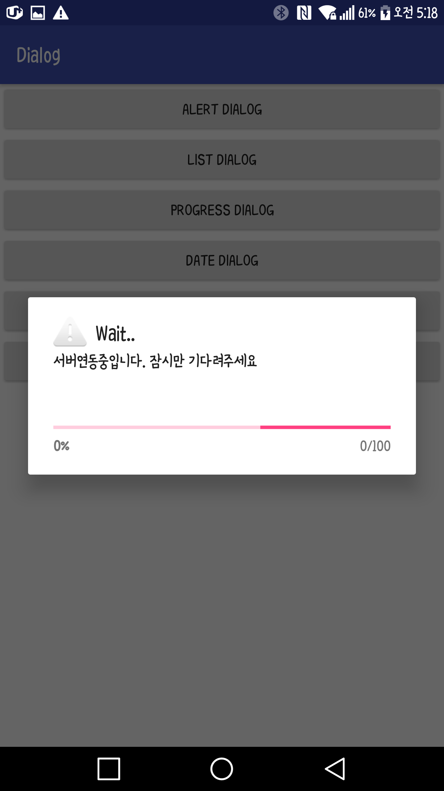
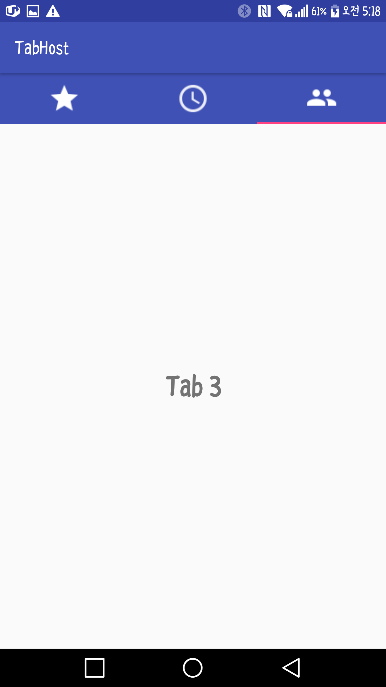
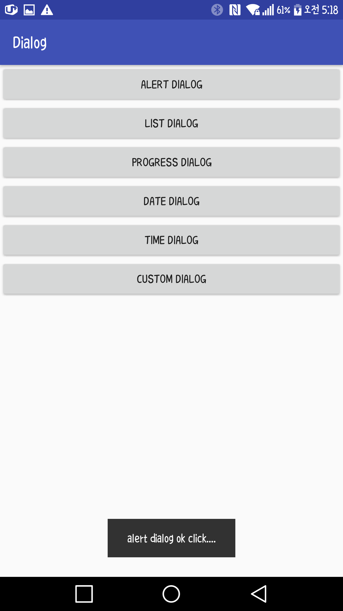
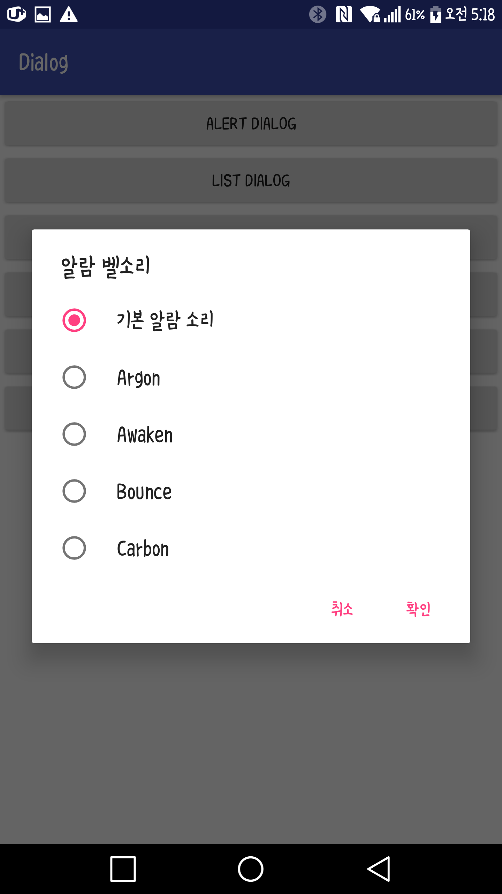
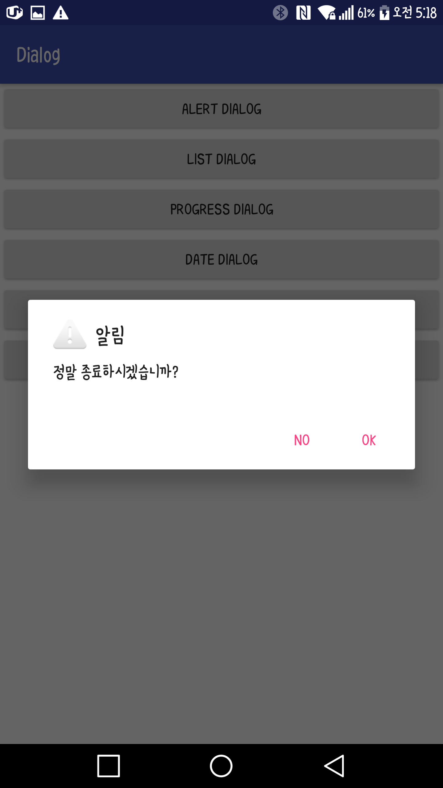
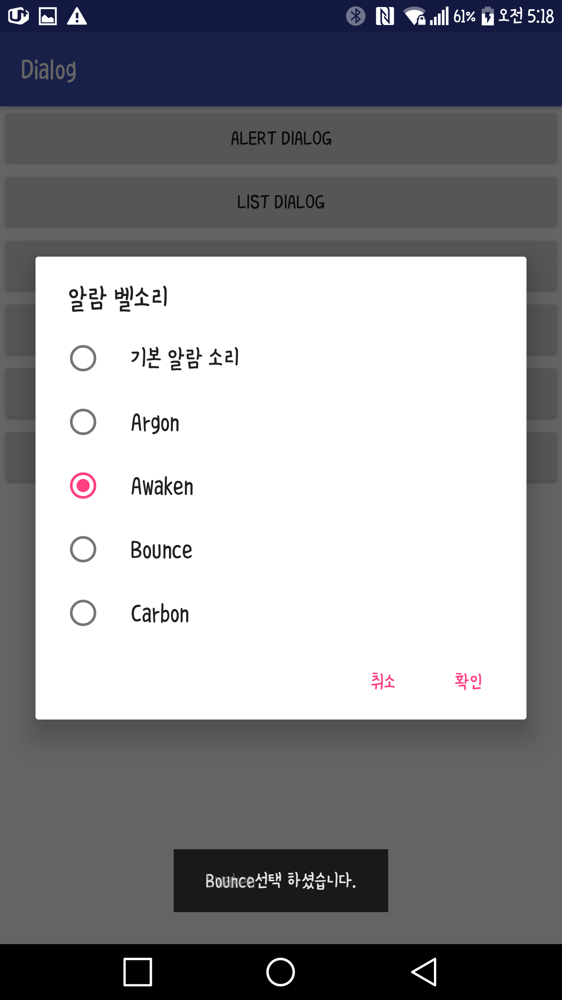
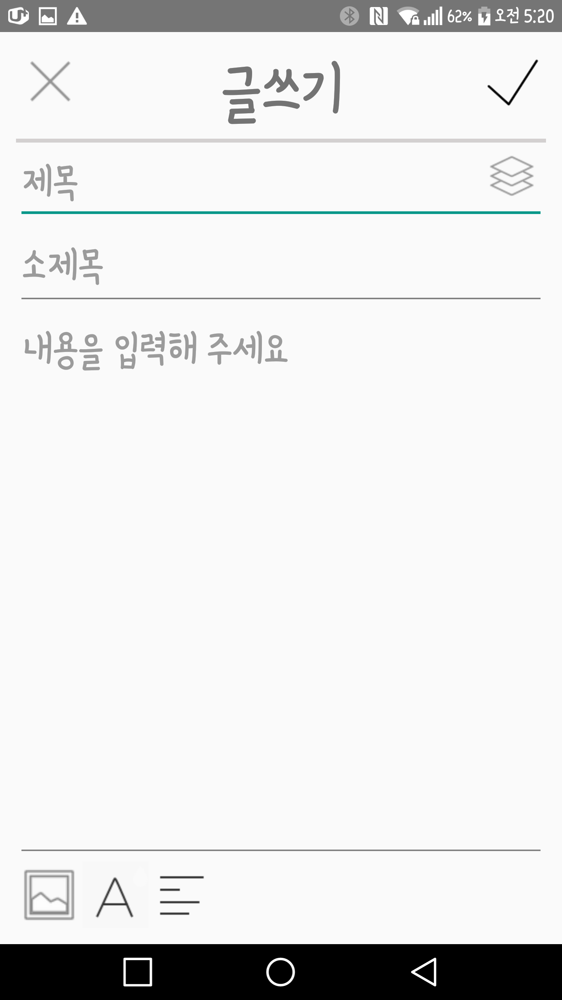
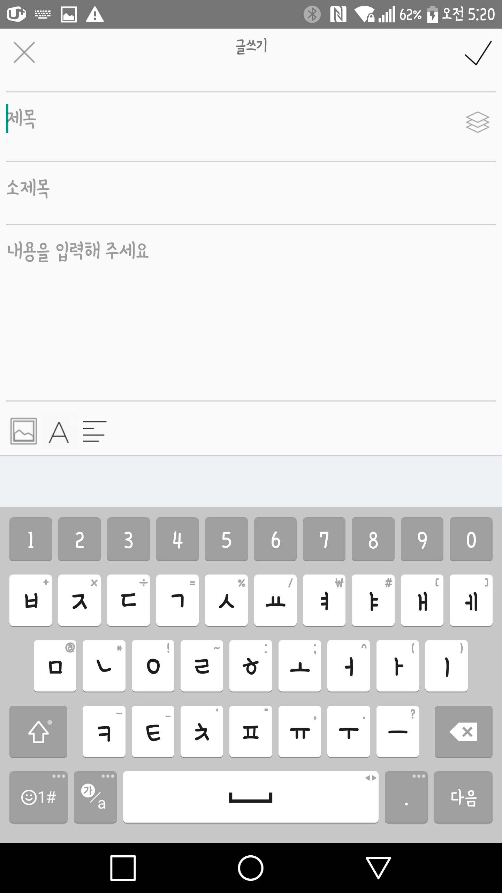

# '깜쌤의 안드로이드 프로그래밍' 책 실습

### 리소스 폴더명 조건 활용하기 (228p)

### visibiliy속성 사용하기 (91p)

### vibrator와 ringtone사용하기 (164p)

### TextView속성 사용하기 (112p)

### TableLayout와GridLayout을 이용하여 계산기 화면 만들기 (151p)

### TabHost를 이용하여 Tab화면 만들기 (140p)

### SQLite를 이용하여 폰에 데이터 저장하기 (249p)

### RelativeLayout속성 사용하기 (132p)

### Realm을 이용하여 폰에 데이터 저장하기(258p)

### LinearLayouy속성 사용하기 (126p)

### Hieratchy이벤트 처리하기 (201p)

### Dialog만을 사용하여 다양한 화면 만들기 (178p)

### Delegation이벤트 처리하기 (194p)

### Challenge01_Mission01 (234p) 나의 답안코드 및 정답코드

### Challenge01_Mission02 (236p) 나의 답안코드 및 정답코드

### Animation효과 사용하기 (216p)

